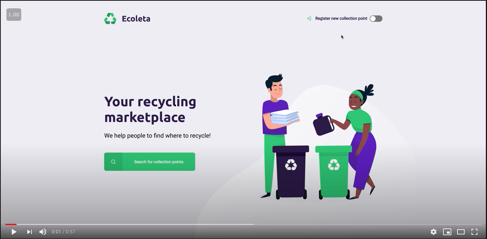

# Ecoleta
Application to keep track of **Recycling points** in the city.

### Functionalities
- Register collection point
  - DB created using **sqlite3**. 
  - The data is currently stored in the Database folder. `database.db` file.
- Search for collections points by city.
- Routes created using: **express**
- Template engine: **nunjucks**

##### Extra features
- Dark Mode
---
### Demonstration

**Watch it on youtube:**

> *Sorry, could not embbed videos in github readme.*

--- 
... Still working in some other functionalities (🤓) and fixing some bugs(🐛).

That's all so far. 👨🏻‍💻
